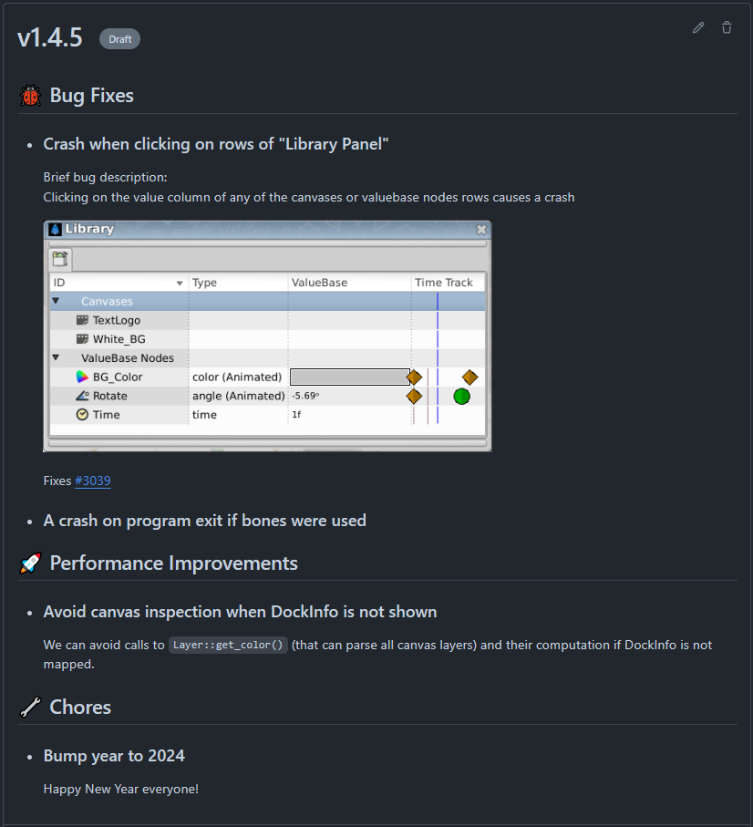
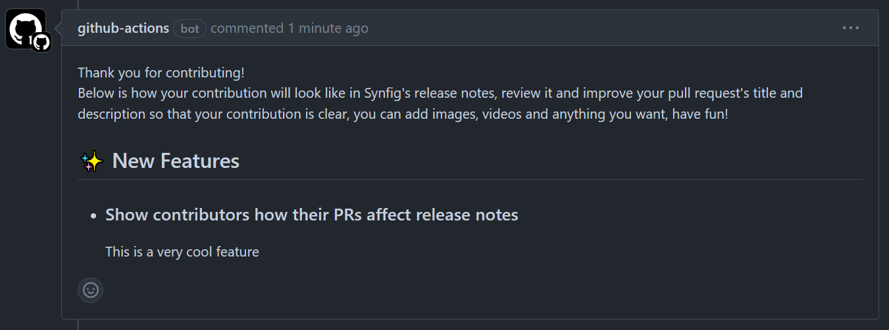
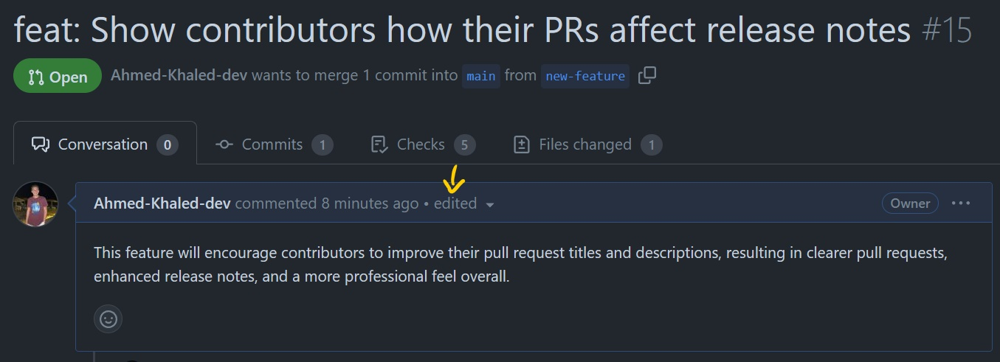
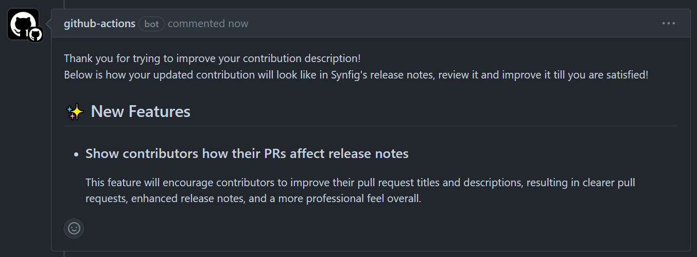
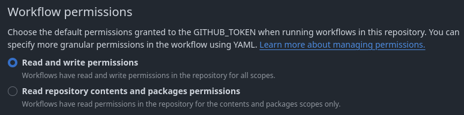
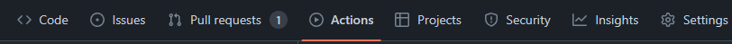
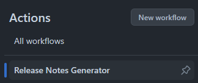

<h1 align="center">
  <br>
    
  <br>
  Release Notes Manager
  <br>
</h1>

<h4 align="center">
Generates accurate markdown/HTML release notes for GitHub releases and shows contributors how their pull requests will affect the notes, encouraging better pull request descriptions.</h4>

<p align="center">
<a href="https://ahmed-khaled-dev.github.io/release-notes-manager/doxygen/generated/index.html">
        
</a>
</p>

<p align="center">
  <a href="#key-features">Key Features</a> •
  <a href="#how-to-use">How To Use</a> •
  <a href="#how-to-build">How To Build</a>
</p>

## Key Features
### 1. Generates markdown/HTML release notes for GitHub releases through a straightforward and customizable GitHub Actions user interface

  <p align="center">
    <br><br>
    Example Of Generating Release Notes in the <a href="https://github.com/synfig/synfig">Synfig Repo</a><br><br>
    <strong>Generated Markdown Release Notes Inside The Release Description</strong><br><br>
    <br><br>
    <strong>Generated HTML Release Notes Attached As An Asset To The Release</strong><br><br>
    
  </p>

### 2. Automatically shows contributors how their pull requests affect the release notes
  
  
  
  
  

## How To Use

  > [!IMPORTANT]
  > For the Release Notes Manager to work, you must grant read and write permissions to workflows, since it will either write release notes inside releases or comment in pull requests
  >
  > In your repository go to Settings -> Actions -> General -> Scroll down and change it as below
  > 
  > 

  ### 1. Generating Release Notes

  1. Go to your repository and create a folder called ``.github`` if it doesn't already exist
  2. Inside ``.github`` create a folder called ``workflows``
  3. Inside ``workflows`` create a file called e.g. ``generate-release-notes.yml``
  4. Copy and paste the following inside ``generate-release-notes.yml``
  
      ```yaml
      name: Generate Release Notes

      on: 
        workflow_dispatch:
          inputs:
            new-release-tag:
              description: 'Tag name of the new release'
              required: true
              type: string
              default: 'e.g., v1.1 or v2.0'
            previous-release-reference:
              description: 'Tag name of the previous release or the commit SHA right before the first commit in the new release'
              required: true
              type: string
              default: 'e.g., v1.0 or 2f4a6b2'
            release-notes-source:
              description: 'Release Notes Source'
              required: true
              type: choice
              options:
              - Commit Messages
              - Pull Requests
              default: 'Pull Requests'
            pr-release-notes-mode:
              description: 'Release Notes Mode (only affects release notes if you chose source as pull requests)'
              required: false
              type: choice
              options:
              - Short
              - Full
              default: 'Full'

      jobs:
        generate-release-notes:
          name: Generate Release Notes
          runs-on: ubuntu-latest
          steps:
            - name: Use The Release Notes Manager Action
              uses: Ahmed-Khaled-dev/release-notes-manager@v1
              env:
                # secrets.GITHUB_TOKEN is automatically generated by GitHub for each workflow run
                GH_TOKEN: ${{ secrets.GITHUB_TOKEN }}
              with:
                action-type: release
                new-release-tag: ${{ inputs.new-release-tag }}
                previous-release-reference: ${{ inputs.previous-release-reference }}
                release-notes-source: ${{ inputs.release-notes-source }}
                pr-release-notes-mode: ${{ inputs.pr-release-notes-mode }}
                github-repository: ${{ github.repository }}
      ```
  5. That's it! Now whenever you want to publish a new release, create a new GitHub draft release with a suitable tag (or don't if you want to generate release notes for an already created release)
  6. Open the GitHub Actions tab
  
      
  7. Press on the "Release Notes Generator" workflow

      
  8. Press on "Run workflow" and have fun generating release notes!
      
      

      **Notes**<br>
      - In the "Release Notes Source" drop-down menu, you specify the source that the content of the release notes will be retrieved from, either from the commit messages of the commits that occurred between the two entered releases, or from the pull requests' titles and descriptions that were used to merge these commits
      - The "Release Notes Mode" drop-down menu is used if you choose the source as pull requests, you can select "Short" mode and generate release notes only from the pull requests' titles without the descriptions, or select "Full" and generate release notes using the pull requests' titles and descriptions

  ### 2. Showing contributors how their pull requests affect the release notes
  
  1. Inside the ``workflows`` folder, create a file called e.g. ``show-pr-change-note.yml``
  2. Copy and paste the following inside it
   
      ```yaml
      name: Show Pull Request Change Note

      on: 
        pull_request:
            types: [opened, edited]

      jobs:
        show-pull-request-change-note:
          name: Show Pull Request Change Note
          runs-on: ubuntu-latest
          steps:
            - name: Use The Release Notes Manager Action
              uses: Ahmed-Khaled-dev/release-notes-manager@v1
              env:
                # secrets.GITHUB_TOKEN is automatically generated by GitHub for each workflow run
                GH_TOKEN: ${{ secrets.GITHUB_TOKEN }}
              with:
                action-type: pr
                pull-request-number: ${{ github.event.pull_request.number }}
                pull-request-trigger-event: ${{ github.event.action }}
                github-repository: ${{ github.repository }}
      ```
  
      That's it! Now automatically whenever a new pull request is created or edited, a GitHub bot will show the contributor how his pull request affects the release notes and will encourage him to improve his change description.

## How To Build

  > [!TIP]
  > These steps are for developers who want to try the C++ script behind the above functionality or contribute to the project.

  ### 1. Clone the repo
  ```
  $ git clone https://github.com/Ahmed-Khaled-dev/release-notes-manager.git
  ```

  ### 2. Install Dependencies
  The program has only 2 dependencies

  1. [libcurl](https://github.com/curl/curl)
    
      The easiest way to install libcurl is using any package manager ([chocolatey](https://github.com/chocolatey/choco) or [vcpkg](https://github.com/microsoft/vcpkg) for Windows and your distro's package manager in Linux)
    
  2. [nlohmann/json.hpp](https://github.com/nlohmann/json)
      
      Download the json.hpp file in the same directory that the script is in, on Windows open [json.hpp](https://github.com/nlohmann/json/blob/develop/single_include/nlohmann/json.hpp) and then download raw file, 
      on Linux run:

        ```
        $ wget https://raw.githubusercontent.com/nlohmann/json/develop/single_include/nlohmann/json.hpp
        ```
  
  ### 3. Run the following command
  ```
  $ g++ -o release_notes_manager Main.cpp Config.cpp Utils.cpp Format.cpp -lcurl -I.
  ```
